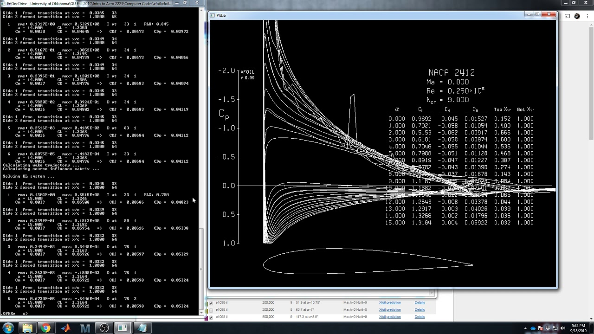

# XFoil-Python
XFoil API for Python

## SET-UP:

* 1 - Install the newest version of XFoil and unzip. <br>
The download can be found at https://web.mit.edu/drela/Public/web/xfoil/

* 2 - Download python module requirements from the 'requirements.txt' file.

* 3 - In 'config.yaml', change the 'xfoil_path' variable to the absolute path XFoil's directory.


## HOW TO USE:
The API is accessed via command line arguments. <p>

In 'config.yaml', modify the values for your calculations <p>

### Getting data:

*  **Method 1: Calc using a Single Value of Cl or Alpha (AoA)**

    usage: <br>
    `Single_calc.py [-h] [-r REYNOLDS_NUM] -t {cl,alpha} -v INPUT_VALUE [-o]
                          [-n AEROFOIL_NAMES [AEROFOIL_NAMES ...]]`
    
    ```
    options:
      -h, --help
                            show this help message and exit
      -r REYNOLDS_NUM, --reynolds_num REYNOLDS_NUM
                            Value of Reynolds Number as integer (-1 for inviscid flow)
      -t {cl,alpha}, --input_type {cl,alpha}
                            Calculate based off cl or alpha
      -v INPUT_VALUE, --input_value INPUT_VALUE
                            Value of cl or alpha
      -o, --delete_old      
                            OPTIONAL: If NOT FLAGGED (true), deletes any previously stored data for inputted aerofoils,
                            else if FLAGGED (false), appends new data to this reviously stored data
      -n AEROFOIL_NAMES [AEROFOIL_NAMES ...], --aerofoil_names AEROFOIL_NAMES [AEROFOIL_NAMES ...]
                            NACA 4-digit aerofoils to test (in "NACAxxxx" form), as a list
    ```
    Examples: <br>
    `python Single_calc.py -t cl -v 0.5 -n NACA1418` <br>
    `python Single_calc.py -r 90000 -t cl -v 0.5 -n NACA1416 NACA1417` <br>
    `python Single_calc.py -r 90000 -t alpha -v 5.0 -n NACA1416 NACA1417` <p>


*  **Method 2: Calc by iterating over a sequence of angles**
    
    usage: <br>
    `Sequence_calc.py [-h] [-r REYNOLDS_NUM] [-o]
                        [-n AEROFOIL_NAMES [AEROFOIL_NAMES ...]]`
    
    ```
    options:
      -h, --help
                            show this help message and exit
      -r REYNOLDS_NUM, --reynolds_num REYNOLDS_NUM
                            Value of Reynolds Number as integer (-1 for inviscid flow)
      -o, --delete_old      
                            OPTIONAL: If NOT FLAGGED (true), deletes any previously stored data for inputted aerofoils,
                            else if FLAGGED (false), appends new data to this reviously stored data
      -n AEROFOIL_NAMES [AEROFOIL_NAMES ...], --aerofoil_names AEROFOIL_NAMES [AEROFOIL_NAMES ...]
                            NACA 4-digit aerofoils to test (in "NACAxxxx" form), as a list
    ```
    Examples: <br>
    `python Sequence_calc.py -r 90000 -n NACA1418` <br>
    `python Sequence_calc.py -r 90000 -o -n NACA1416 NACA1417` <br>
    `python Sequence_calc.py -r 90000 -n NACA1416 NACA1417`


### Plotting data:
*  **Method 1: From data collected via method 1**

    usage: <br>
    `Single_plot.py [-h] [-n AEROFOIL_NAMES [AEROFOIL_NAMES ...]]`
    
    ```
    options:
      -h, --help            show this help message and exit
      -n AEROFOIL_NAMES [AEROFOIL_NAMES ...], --aerofoil_names AEROFOIL_NAMES [AEROFOIL_NAMES ...]
                        NACA 4-digit aerofoils to test (in "NACAxxxx" form).
                        If left empty, will plot every aerofoil that has data in the directory
                        
    ```
    Examples: <br>
    `python Single_plot.py` <br>
    `python Single_plot.py -n NACA1418` <br>
    `python Single_plot.py -n NACA1416 NACA1417`  <p>


*  **Method 2: From data collected via method 2**

    usage: <br>
    `Sequence_plot.py [-h] [-n AEROFOIL_NAMES [AEROFOIL_NAMES ...]]`
    
    ```
    options:
      -h, --help            show this help message and exit
      -n AEROFOIL_NAMES [AEROFOIL_NAMES ...], --aerofoil_names AEROFOIL_NAMES [AEROFOIL_NAMES ...]
                        NACA 4-digit aerofoils to test (in "NACAxxxx" form).
                        If left empty, will plot every aerofoil that has data in the directory
                        
    ```
    Examples: <br>
    `python Sequence_plot.py` <br>
    `python Sequence_plot.py -n NACA1418` <br>
    `python Sequence_plot.py -n NACA1416 NACA1417`


### Further Details:
For more details on using XFoil, visit <br>
https://web.mit.edu/drela/Public/web/xfoil/ <p>

